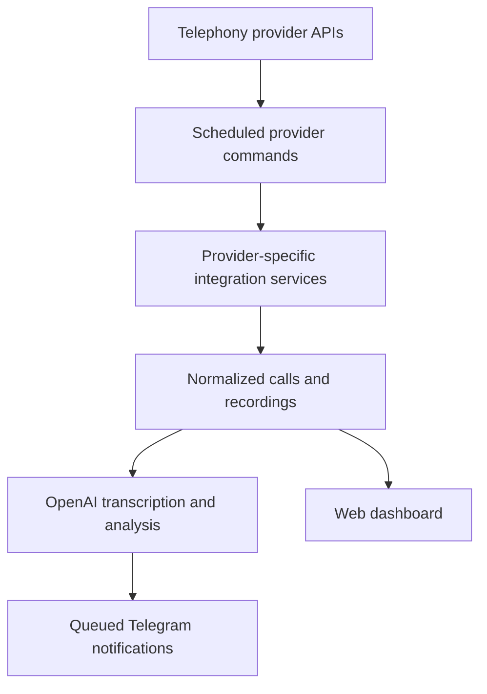

**English** | [Русский](README.ru.md)

# Voice2AI — Multi-Provider Telephony Integration

A Laravel application that aggregates calls from multiple cloud telephony providers, stores call metadata and recordings in one place, analyzes conversations with OpenAI, and sends actionable notifications to Telegram.

The project solves a practical integration problem: Binotel, Zadarma, Unitalk, and Phonet expose different authentication methods, payloads, call statuses, and recording formats. Voice2AI normalizes those differences behind provider-specific services and a shared processing workflow.

## What the application does

- Imports incoming and outgoing calls from four telephony providers.
- Normalizes provider payloads into a shared `Call` model.
- Prevents duplicate calls using the integration and external call ID.
- Downloads and stores call recordings.
- Transcribes answered calls with OpenAI Whisper.
- Creates short call summaries and detects potentially conflicting conversations.
- Classifies leads, identifies new clients, and assigns tags and an interest score.
- Sends queued notifications for answered and missed calls to Telegram.
- Provides an authenticated dashboard with call filters, playback, listened status, and starred calls.
- Manages integrations, notification settings, tariffs, payment details, and billing-related workflows.
- Runs provider synchronization and maintenance tasks through Laravel Scheduler.

## Processing flow



Each active integration keeps its own synchronization cursor in `prev_timestamp`. Provider-specific services fetch only the relevant time window, map remote fields to the common domain model, save recordings, and advance the cursor after processing.

## Supported providers

| Provider | Call history | Recordings | Authentication |
|---|---:|---:|---|
| Binotel | Yes | Yes, including pending recordings | API key and secret |
| Zadarma | Yes | Yes | Signed API requests |
| Unitalk | Yes | Yes | Bearer token |
| Phonet | Yes, with pagination | Yes | API authorization with session cookies |

## Tech stack

- PHP 8.2+
- Laravel 12
- MySQL / MariaDB
- Laravel Queues with the database driver
- Laravel Scheduler
- OpenAI API (`whisper-1` and GPT models)
- Telegram Bot API
- Blade, Tailwind CSS, Vite, and JavaScript
- PHPUnit
- Python helper for rich Telegram call notifications

## Project structure

```text
app/
├── Console/Commands/              Provider sync and maintenance commands
├── DTO/IntegrationProcess/        Shared integration result objects
├── Jobs/                          Queued call and Telegram processing
├── Models/                        Calls, integrations, providers, and billing
├── Services/IntegrationProcess/   Provider-specific normalization workflows
├── Services/OpenAi/               Transcription and conversation analysis
├── Services/Telegram/             Telegram notifications and payment callbacks
└── Services/{Provider}/            Low-level provider API clients
```

## Local setup

### Requirements

- PHP 8.2 or newer
- Composer
- MySQL or MariaDB
- Node.js and npm
- Python 3 with `requests` and `aiogram`

### Installation

```bash
git clone https://github.com/sunnbroi/voice2ai-multi-provider-telephony-integration.git
cd voice2ai-multi-provider-telephony-integration

composer install
npm ci
python -m pip install requests aiogram

cp .env.example .env
php artisan key:generate
```

Create a database and configure the `DB_*` values in `.env`, then run:

```bash
php artisan migrate --seed
php artisan storage:link
npm run build
```

Create an application user before signing in. For example:

```bash
php artisan tinker
```

```php
App\Models\User::create([
    'name' => 'Admin',
    'email' => 'admin@example.com',
    'password' => bcrypt('change-this-password'),
]);
```

Add the required OpenAI and Telegram values to `.env`. Telephony credentials are configured per integration in the application dashboard.

### Run the application

Use separate terminals for the web server, queue worker, and local scheduler:

```bash
php artisan serve
php artisan queue:work --tries=3
php artisan schedule:work
```

For frontend development, run:

```bash
npm run dev
```

In production, configure a cron entry that runs `php artisan schedule:run` every minute and keep the queue worker under a process manager.

## Environment variables

The main application-level settings are:

| Variable | Purpose |
|---|---|
| `APP_DOMAIN` | Domain used by the web routes |
| `DB_*` | Database connection |
| `QUEUE_CONNECTION` | Queue driver; the example uses `database` |
| `OPENAI_API_KEY` | Transcription and conversation analysis |
| `TELEGRAM_BOT_TOKEN` | Telegram Bot API access |
| `TELEGRAM_ADMIN_CHAT_ID` | Administrative notifications |
| `TELEGRAM_LEADS_CHANNEL_ID` | New-lead notifications |
| `RECORD_DOMAIN` | Public domain used for recording playback links |
| `PHONET_VERIFY_SSL` | TLS verification for Phonet requests |

Never commit a real `.env` file or provider credentials. The repository contains only a safe `.env.example` template.

## Scheduled commands

| Command | Schedule | Purpose |
|---|---|---|
| `binotel:fetch-calls` | Every minute | Import Binotel calls |
| `binotel:fetch-recordings` | Every minute | Retry pending Binotel recordings |
| `zadarma:fetch-calls` | Every minute | Import Zadarma calls |
| `phonet:fetch-calls` | Every minute | Import Phonet calls |
| `unitalk:fetch-calls` | Every minute | Import Unitalk calls |
| `report:daily-calls` | Daily at 21:00 | Send a daily call report |
| `recordings:clean-old` | Daily at 23:00 | Remove old recordings when disk usage is high |
| `payment-request:integration-all` | Monthly | Prepare integration payment requests |

## Tests and code style

The test suite loads the MySQL schema dump, so it requires a running MySQL/MariaDB server and the `mysql` command-line client. Always use a dedicated empty test database: Laravel may reset all tables in that database.

On Windows with XAMPP:

1. Create an empty database named `voice2api_testing` in phpMyAdmin.
2. Create the local environment file if it does not exist:

```powershell
Copy-Item .env.example .env
php artisan key:generate
```

3. Configure the current PowerShell session and run the tests:

```powershell
$env:Path = "C:\xampp\mysql\bin;$env:Path"
$env:DB_CONNECTION = "mysql"
$env:DB_HOST = "127.0.0.1"
$env:DB_PORT = "3306"
$env:DB_DATABASE = "voice2api_testing"
$env:DB_USERNAME = "root"
$env:DB_PASSWORD = ""

php artisan config:clear
php artisan test
```

Adjust the MySQL path and credentials when your local installation differs. A successful run currently reports `8 passed (18 assertions)`. These tests use simulated provider responses and do not require live Phonet or other telephony credentials.

Run the code-style check separately:

```bash
php vendor/bin/pint --test
```

To automatically format changed PHP files before a commit:

```bash
php vendor/bin/pint --dirty
```

## Security notes

- Runtime secrets are excluded from Git and supplied through environment variables or per-integration configuration.
- Login sessions protect the management dashboard.
- Provider failures are logged, and critical integration failures can trigger administrator notifications.
- The application validates recording paths before serving local audio files.
