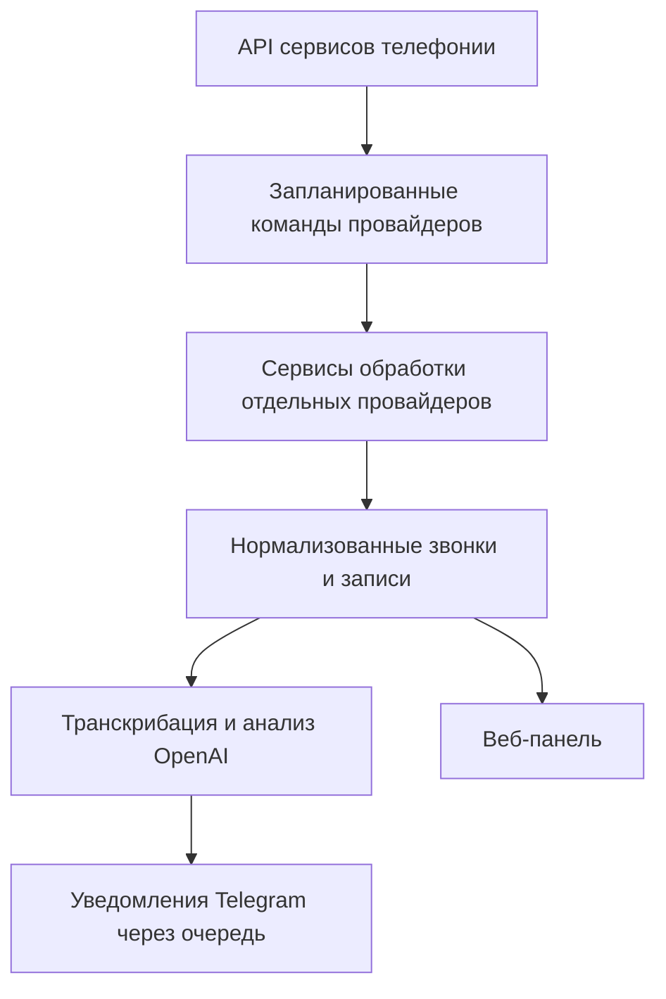

[English](README.md) | **Русский**

# Voice2AI — интеграция с несколькими провайдерами телефонии

Laravel-приложение, которое собирает звонки из нескольких облачных сервисов телефонии, хранит метаданные и записи разговоров в одном месте, анализирует разговоры с помощью OpenAI и отправляет полезные уведомления в Telegram.

Проект решает практическую задачу интеграции: Binotel, Zadarma, Unitalk и Phonet используют разные способы авторизации, форматы данных, статусы звонков и форматы записей. Voice2AI скрывает эти различия за отдельными сервисами провайдеров и общим процессом обработки.

## Что делает приложение

- Импортирует входящие и исходящие звонки из четырёх сервисов телефонии.
- Приводит данные разных провайдеров к общей модели `Call`.
- Предотвращает дублирование звонков по интеграции и внешнему идентификатору звонка.
- Загружает и сохраняет записи разговоров.
- Расшифровывает принятые звонки с помощью OpenAI Whisper.
- Создаёт краткие резюме звонков и выявляет потенциально конфликтные разговоры.
- Классифицирует лиды, определяет новых клиентов, назначает теги и оценку заинтересованности.
- Отправляет через очередь уведомления о принятых и пропущенных звонках в Telegram.
- Предоставляет защищённую авторизацией панель со списком и фильтрами звонков, воспроизведением записей и отметками «прослушано» и «избранное».
- Позволяет управлять интеграциями, настройками уведомлений, тарифами, платёжными реквизитами и процессами, связанными с оплатой.
- Запускает синхронизацию с провайдерами и служебные задачи через Laravel Scheduler.

## Процесс обработки



Каждая активная интеграция хранит собственную позицию синхронизации в `prev_timestamp`. Сервисы провайдеров запрашивают нужный временной интервал, преобразуют удалённые данные в общую доменную модель, сохраняют записи разговоров и после обработки обновляют позицию синхронизации.

## Поддерживаемые провайдеры

| Провайдер | История звонков | Записи | Авторизация |
|---|---:|---:|---|
| Binotel | Да | Да, включая ожидающие записи | API-ключ и секрет |
| Zadarma | Да | Да | Подписанные API-запросы |
| Unitalk | Да | Да | Bearer-токен |
| Phonet | Да, с пагинацией | Да | API-авторизация с cookie сессии |

## Технологии

- PHP 8.2+
- Laravel 12
- MySQL / MariaDB
- Laravel Queues с драйвером базы данных
- Laravel Scheduler
- OpenAI API (`whisper-1` и модели GPT)
- Telegram Bot API
- Blade, Tailwind CSS, Vite и JavaScript
- PHPUnit
- Python-скрипт для расширенных уведомлений о звонках в Telegram

## Структура проекта

```text
app/
├── Console/Commands/              Команды синхронизации и обслуживания
├── DTO/IntegrationProcess/        Общие объекты результата интеграции
├── Jobs/                          Обработка звонков и Telegram через очередь
├── Models/                        Звонки, интеграции, провайдеры и оплата
├── Services/IntegrationProcess/   Нормализация данных отдельных провайдеров
├── Services/OpenAi/               Транскрибация и анализ разговоров
├── Services/Telegram/             Уведомления Telegram и обработчики оплаты
└── Services/{Provider}/           Низкоуровневые API-клиенты провайдеров
```

## Локальная установка

### Требования

- PHP 8.2 или новее
- Composer
- MySQL или MariaDB
- Node.js и npm
- Python 3 с пакетами `requests` и `aiogram`

### Установка

```bash
git clone https://github.com/sunnbroi/voice2ai-multi-provider-telephony-integration.git
cd voice2ai-multi-provider-telephony-integration

composer install
npm ci
python -m pip install requests aiogram

cp .env.example .env
php artisan key:generate
```

Создайте базу данных и настройте значения `DB_*` в файле `.env`, затем выполните:

```bash
php artisan migrate --seed
php artisan storage:link
npm run build
```

Перед входом создайте пользователя приложения. Например:

```bash
php artisan tinker
```

```php
App\Models\User::create([
    'name' => 'Admin',
    'email' => 'admin@example.com',
    'password' => bcrypt('change-this-password'),
]);
```

Добавьте необходимые значения OpenAI и Telegram в `.env`. Данные доступа к сервисам телефонии настраиваются отдельно для каждой интеграции в панели приложения.

### Запуск приложения

Используйте отдельные терминалы для веб-сервера, обработчика очереди и локального планировщика:

```bash
php artisan serve
php artisan queue:work --tries=3
php artisan schedule:work
```

Для разработки фронтенда запустите:

```bash
npm run dev
```

В production-среде настройте cron, который каждую минуту запускает `php artisan schedule:run`, и управляйте обработчиком очереди через менеджер процессов.

## Переменные окружения

Основные настройки приложения:

| Переменная | Назначение |
|---|---|
| `APP_DOMAIN` | Домен, используемый веб-маршрутами |
| `DB_*` | Подключение к базе данных |
| `QUEUE_CONNECTION` | Драйвер очереди; в примере используется `database` |
| `OPENAI_API_KEY` | Транскрибация и анализ разговоров |
| `TELEGRAM_BOT_TOKEN` | Доступ к Telegram Bot API |
| `TELEGRAM_ADMIN_CHAT_ID` | Административные уведомления |
| `TELEGRAM_LEADS_CHANNEL_ID` | Уведомления о новых лидах |
| `RECORD_DOMAIN` | Публичный домен для ссылок на воспроизведение записей |
| `PHONET_VERIFY_SSL` | Проверка TLS-сертификата в запросах к Phonet |

Никогда не добавляйте настоящий файл `.env` или данные доступа к провайдерам в Git. Репозиторий содержит только безопасный шаблон `.env.example`.

## Запланированные команды

| Команда | Расписание | Назначение |
|---|---|---|
| `binotel:fetch-calls` | Каждую минуту | Импорт звонков Binotel |
| `binotel:fetch-recordings` | Каждую минуту | Повторная загрузка ожидающих записей Binotel |
| `zadarma:fetch-calls` | Каждую минуту | Импорт звонков Zadarma |
| `phonet:fetch-calls` | Каждую минуту | Импорт звонков Phonet |
| `unitalk:fetch-calls` | Каждую минуту | Импорт звонков Unitalk |
| `report:daily-calls` | Ежедневно в 21:00 | Отправка ежедневного отчёта по звонкам |
| `recordings:clean-old` | Ежедневно в 23:00 | Удаление старых записей при высокой загрузке диска |
| `payment-request:integration-all` | Ежемесячно | Подготовка платёжных запросов по интеграциям |

## Тесты и стиль кода

```bash
php artisan test
php vendor/bin/pint --test
```

Чтобы автоматически отформатировать изменённые PHP-файлы перед коммитом:

```bash
php vendor/bin/pint --dirty
```

## Заметки по безопасности

- Секреты среды выполнения исключены из Git и передаются через переменные окружения или настройки конкретной интеграции.
- Панель управления защищена авторизацией и пользовательскими сессиями.
- Ошибки провайдеров записываются в журнал, а критические сбои интеграций могут отправлять уведомления администратору.
- Перед выдачей локальных аудиофайлов приложение проверяет пути к записям.
